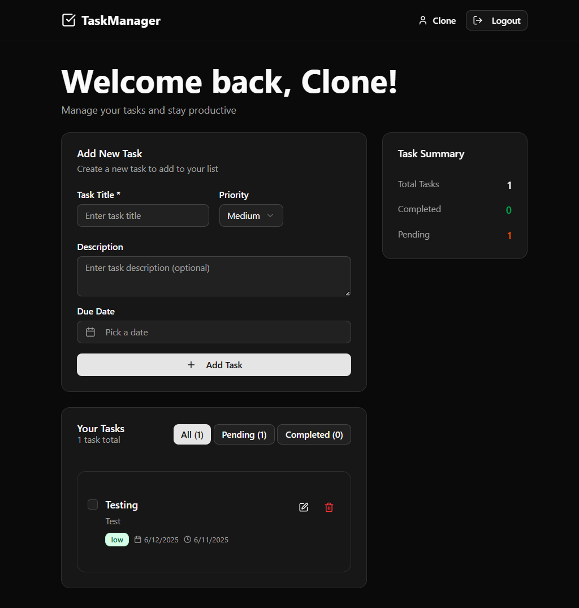

# Assignment 1: Task Manager App

## Overview

A full-stack MERN application with user authentication and task management functionality.

## Features

- User registration and login with JWT authentication
- Task CRUD operations (Create, Read, Update, Delete)
- Task status toggle (pending/completed)
- Redux state management on frontend
- MongoDB database integration
- Responsive design

## Tech Stack

- **Frontend**: React.js, Redux Toolkit, Tailwind CSS, shadcn/ui
- **Backend**: Node.js, Express.js
- **Database**: MongoDB
- **Authentication**: JWT (JSON Web Tokens)

> **Note:** The UI is built using Tailwind CSS utility classes and shadcn/ui React components for a modern, accessible design.

## Project Structure

```
Assignment-1/
├── client/                 # React frontend
│   ├── src/
│   │   ├── components/
│   │   │   ├── auth/      # Auth pages and logic
│   │   │   ├── layout/    # Navigation and layout
│   │   │   ├── tasks/     # Task management UI
│   │   │   └── ui/        # shadcn/ui components
│   │   ├── hooks/         # Custom React hooks
│   │   ├── lib/           # Utility functions
│   │   ├── services/      # API calls (axios)
│   │   └── store/         # Redux store and slices
│   ├── public/
│   └── package.json
├── server/                 # Express backend
│   ├── config/            # Database config
│   ├── controllers/       # Route handlers
│   ├── middleware/        # Auth middleware
│   ├── models/            # Mongoose schemas
│   ├── routes/            # API routes
│   └── package.json
├── vivek-gangani.vercel.app_dashboard.png
├── vivek-gangani.vercel.app_login.png
├── vivek-gangani.vercel.app_signup.png
└── README.md
```

## Setup Instructions

### Prerequisites

- Node.js (v14 or higher)
- MongoDB (local or Atlas)
- Git

### Installation

1. **Clone the repository**

   ```bash
   git clone <repository-url>
   cd Assignment-1
   ```

2. **Backend Setup**

   ```bash
   cd server
   npm install
   ```

3. **Frontend Setup**

   ```bash
   cd client
   npm install
   ```

4. **Environment Variables**
   Create `.env` file in server directory:

   ```
   PORT=5000
   MONGODB_URI=mongodb://localhost:27017/taskmanager
   JWT_SECRET=your_jwt_secret_key
   ```

5. **Run the Application**

   Backend (Terminal 1):

   ```bash
   cd server
   npm run dev
   ```

   Frontend (Terminal 2):

   ```bash
   cd client
   npm start
   ```

## API Endpoints

### Authentication

- `POST /api/auth/register` - User registration
- `POST /api/auth/login` - User login

### Tasks

- `GET /api/tasks` - Get all user tasks
- `POST /api/tasks` - Create new task
- `PUT /api/tasks/:id` - Update task
- `DELETE /api/tasks/:id` - Delete task
- `PATCH /api/tasks/:id/toggle` - Toggle task status

## Features Implemented

- [x] User authentication (register/login)
- [x] JWT token management
- [x] Task CRUD operations
- [x] Task status toggle
- [x] Redux state management
- [x] Responsive design
- [x] Error handling
- [x] Form validation

## Demo

[Live Demo](https://vivek-gangani.vercel.app)

## Screenshots




<!-- Add more screenshots below as needed -->

## Challenges Faced

- **CORS Configuration:**
  Ensuring the backend CORS setup allowed requests from the correct frontend origin, supported credentials, and included all necessary HTTP methods and headers. This required several iterations to get right, especially when deploying or switching between local and production environments.

- **Frontend/Backend Integration:**
  Handling authentication tokens and protected routes required careful coordination between the frontend and backend, especially with JWT and Redux state persistence.

- **Vercel Deployment & Routing:**
  Setting up Vercel for frontend deployment required custom `vercel.json` rewrites to ensure client-side routing worked and the app always served `index.html` for unknown routes.

- **Error Handling & User Feedback:**
  Providing clear error messages and toasts for authentication and task actions, and ensuring errors were not lost due to redirects or state resets.

## Author

Vivek Gangani

## Submission Date

11th June, 2025
